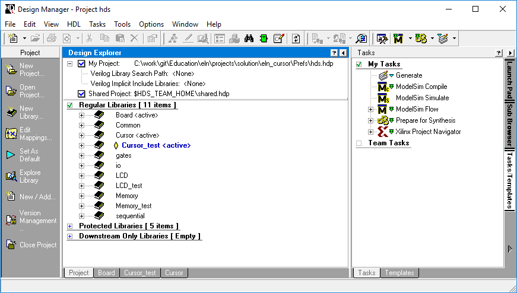

<h1 align="center">
  <br>
  
  <br>
  ELN Project Cursor
</br> Rémi Heredero & Simon Donnet-Monnet
  <br>
</h1>

<h4 align="center">Labor Files for ELN Semester Project Cursor <a href="https://cyberlearn.hes-so.ch/course/view.php?id=14276" target="_blank">Moodle Cyberlearn</a>.</h4>

# Table of contents

<p align="center">
  <a href="#description">Description</a> •
  <a href="#how-to-use">How To Use</a> •
  <a href="#credits">Credits</a> •
  <a href="#license">License</a> •
  <a href="#fund-us-on">Find us on</a>
</p>



## Description

[(Back to top)](#table-of-contents)

Laboratory file for semesterproject chronometer for first year bachelor students.

As it changes each year, all you have to do is search on `<a href="https://cyberlearn.hes-so.ch" target="_blank">`Moodle Cyberlearn`</a>` for the course number and select the one starting with the last two digits of the current year.

Course number is 2131 for SYND

The course full name is composed as a concatenation of year (YY), school name, course ID and course name: "YY_HES-SO-VS_2131_Electricite / Elektrotechnik ELN"

## How To Use

[(Back to top)](#table-of-contents)

To clone and run this application, you'll need [Git](https://git-scm.com) and [HDL Designer](https://www.mentor.com/products/fpga/hdl_design/hdl_designer_series/) as well as [Modelsim](https://www.mentor.com/products/fv/modelsim/) installed on your computer. From your command line:


### Launch

```bash
# Change to location for the Sourcecode on your PC for Example Base of Drive U:
U:

# Clone this repository
git clone https://github.com/hei-synd-2131-eln/eln_cursor.git

# Go into the repository
cd eln_cursor

# Run the app
## Linux
./eln_cursor.bash

## Windows
.\eln_cursor.bat
```

### Update Student **Fork** to the latest modification from **Master** Repo

```bash
# goto your student fork repo location
cd u:\eln_cursor\

# add upstream Master remote
git remote add upstream https://github.com/hei-synd-2131-eln/eln_cursor.git

# like "git pull" which is fetch + merge)
git fetch upstream
git merge upstream/master master

# Push the changes into your own fork repo
git push origin master
```

## Credits

[(Back to top)](#table-of-contents)

* COF
* PRC
* ZAS

## License

[(Back to top)](#table-of-contents)

©️ [All rights reserved](LICENSE)

---

## Find us on

> [hevs.ch](https://www.hevs.ch) &nbsp;&middot;&nbsp;
> Facebook [@hessovalais](https://www.facebook.com/hessovalais) &nbsp;&middot;&nbsp;
> Twitter [@hessovalais](https://twitter.com/hessovalais) &nbsp;&middot;&nbsp;
> LinkedIn [HES-SO Valais-Wallis](https://www.linkedin.com/groups/104343/) &nbsp;&middot;&nbsp;
> Youtube [HES-SO Valais-Wallis](https://www.youtube.com/user/HESSOVS)
